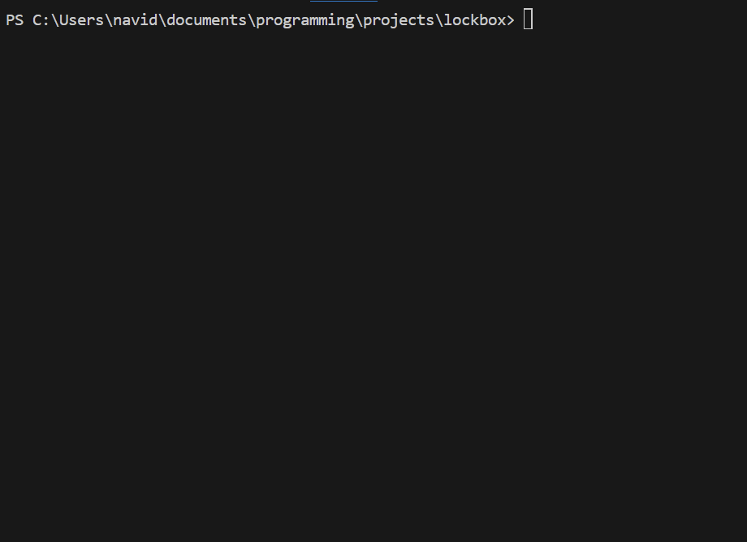

# Lockbox: Local-Only Password Manager

Lockbox is a local-only, command line password manager built with Python.

## Demo

## How it works

Lockbox is built using RSA asymmetric encryption. When a user first starts the program, they set a master password and Lockbox generates a key pair. The public key is stored in the SQLite database for encryption but the private key is presented to the user and never stored by the program. If the user loses the private key, they no longer have access to their vault. Whenever a new password is generated, it is encrypted using the public key and stored in the database. When the user retrieves that password at a later point, it is decrypted using the private key provided as a command line argument by the user.

## How to use it

### Recommendations

- Lockbox is unopinionated as far as password complexity and length are concerned. Make sure you are selecting appropriate lengths and that are your master password is sufficiently sophisticated.
- For maximum security, store your private key on a USB drive and only insert it when you are using Lockbox. After your session is complete, remove the USB drive and make sure there is no copy of the private key on the computer.

### Running the application

1. In order to have access to the `lockbox [arg1]` command instead of having to type `python main.py [arg1]` run `pip install -e`
2. Enter `lockbox` to get started
3. On subsequent uses, you'll need to enter `lockbox [path to private key]`
